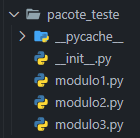

# Diferenças entre Módulo e Pacote


## Módulo

* É simplesmente um arquivo Python que contém definições de classes,  funções, variáveis ou outras declarações de código.
* Geralmente tem a extensão ``.py``.
* Um módulo pode ser importado em outros arquivos Python para reutilização de código.

## Pacote

* É uma coleção de módulos organizados em um diretório hierárquico.
* Ele também contém um arquivo especial chamado ``__init__.py``, que indica que o diretório deve ser tratado como um pacote Python.
* Os pacotes podem conter outros subpacotes, bem como módulos individuais.
* Eles são usados para organizar e modularizar grandes projetos Python, dividindo-os em unidades menores e mais gerenciáveis.


```python
# Importando um Pacote


from pacote_teste.modulo_teste import nome_do_modulo


nome_do_modulo()  # Sou o Módulo de Testes do Pacote de Testes
```


## Organização do Pacote

